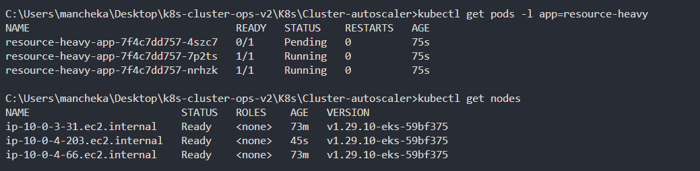
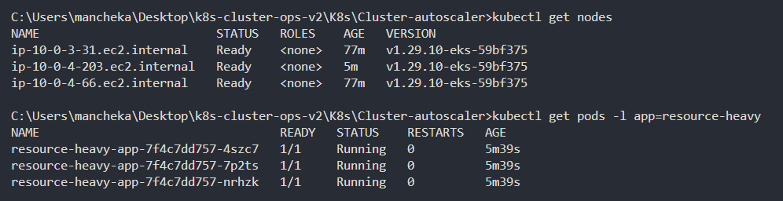
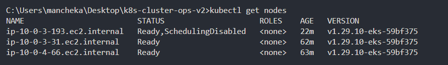
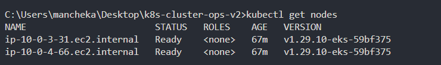

Reference: 
- https://docs.aws.amazon.com/eks/latest/userguide/autoscaling.html
- https://github.com/kubernetes/autoscaler/blob/master/cluster-autoscaler/cloudprovider/aws/README.md
- https://registry.terraform.io/providers/hashicorp/aws/latest/docs/resources/eks_pod_identity_association
- https://artifacthub.io/packages/helm/cluster-autoscaler/cluster-autoscaler?modal=install
- https://github.com/kubernetes/autoscaler/blob/master/cluster-autoscaler/cloudprovider/aws/README.md


best article for "WHY POD IDENTITY > IRSA"
- https://medium.com/@marco.sciatta/aws-eks-from-irsa-to-pod-identity-with-terraform-c523423678b8


```
cd K8s/Cluster-autoscaler
kubectl apply -f resource-heavy-app-deployment.yaml
```
you can see the pods getting scheduled
```
kubectl get pods -l app=resource-heavy
```

now lets scale our deployment, in resource-heavy-app-deployment.yaml update the replicas from 2 to 3
```
kubectl apply -f resource-heavy-app-deployment.yaml
```

you can see the third pod in pending state
```
kubectl get pods -l app=resource-heavy
```

after a while you can see a new node came up, so nodes scaled from 2 to 3
```
kubectl get nodes
```




if a node is not needed then u can see following log and the node will be removed
```
kubectl logs -f -n kube-system --tail 100 autoscaler-aws-cluster-autoscaler-85dc9d7fb7-lgcsh
> Successfully added ToBeDeletedByClusterAutoscaler on node ip-10-0-3-193.ec2.internal
```

